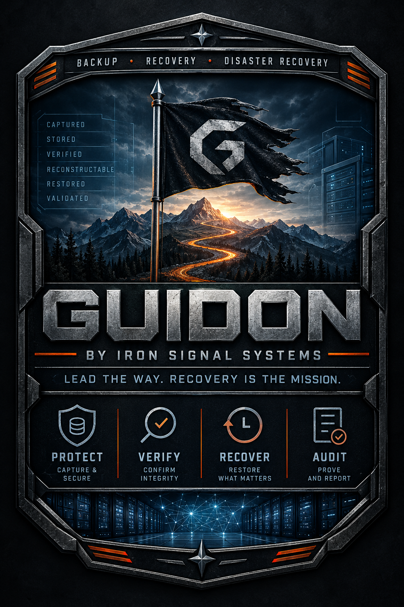

# Guidon

<p align="center">
  
</p>

<p align="center"><strong>Guidon by Iron Signal Systems</strong><br>
<strong>Lead the way. Recovery is the mission.</strong></p>

> **Status:** Pre-alpha / engineering foundation.  
> **Production status:** NOT PRODUCTION READY.

Guidon is an Iron Signal Systems backup, recovery, and disaster-recovery project.

Guidon is built around a simple requirement:

> **Back up a supported system or workload, recover it at the level required, and be able to trust what was captured, what was recovered, who caused the operation, and how Guidon determined that it succeeded.**

Backup creation is not the mission.

**Recovery is.**

---

## Product scope

The current Guidon scope is intentionally narrow:

- **Windows Server and Workstation** — full system, volume, directory, and individual-file recovery;
- **PostgreSQL** — physical base backup, WAL protection, point-in-time recovery, logical backup, and database/schema/table recovery; and
- **Microsoft SQL Server** — full/differential/log backup, complete database recovery, alternate-name/location recovery, point-in-time recovery, and later granular recovery through supported isolated restore/extraction paths.

Containers, Kubernetes, hypervisors, cloud workload families, Microsoft 365, Exchange, Oracle, and other workload families are outside the current project scope.

---

## Core principles

### Recovery first

A completed backup job does not prove that a workload can be recovered. Guidon development is driven by demonstrated recovery paths.

### Report only what Guidon can establish

Guidon does not turn observations into unsupported conclusions. It records what it observed, authenticated, resolved, received, stored, cryptographically verified, attempted, changed, rejected, or encountered.

Unknown, unavailable, unsupported, incomplete, not-observed, not-present, and not-performed conditions remain visible.

### Explicit recovery states

Guidon uses distinct states with narrow meanings:

```text
RECEIVED
STORED
VERIFIED
COMMITTED
RECONSTRUCTION_VERIFIED
RESTORED
VALIDATED
```

A state advances only after the action or verification defining that state was actually performed.

### Immutable recovery data and history

Repository objects are immutable exact byte sequences identified by SHA-256. Recovery points have separate UUIDv7 identities and reference immutable versioned manifests. Authoritative operational records are append-only historical facts.

The catalog is an acceleration and projection layer, not the sole authority for recovery data.

### Secure, identity-bound transport

Every Guidon-controlled connection carrying data, control, authentication, journal, recovery, management, replication, witness, or integration traffic must be encrypted, peer-authenticated, identity-bound, fail closed, and have no plaintext fallback.

This applies even between Guidon Jails on the same FreeBSD host.

### Constrained operations, not remote shell

Guidon jobs are typed, signed, scoped, expiring, replay-resistant operations. Guidon must not become a general-purpose remote shell, PowerShell runner, arbitrary script system, or generic remote-code-execution framework.

Any complete Guidon Job that is durably queued/spooled is encrypted at rest; the exact signed Job bytes are recovered only for validation/execution. Policy-defined interactive privileged Jobs require MFA bound to the exact Job authorization.

### Separate authorities

Human authorization, MFA factors, Windows execution identity, endpoint transport identity, Controller job signing, Journal attestation signing, AD authorization signing, recovery-copy administration, storage-encryption authority, and break-glass Recovery Authority are separate security concerns and must not silently collapse into one credential or key.

### Failure is part of the product

Failures, refusals, integrity mismatches, unavailable dependencies, incomplete operations, and reconciliation outcomes are first-class records. Guidon must not hide meaningful failure information behind a generic success/failure flag.

---

## Initial architecture direction

The first implementation path is intentionally small:

```text
Domain-joined Windows Server / Workstation
        |
        | Guidon service using gMSA
        | outbound mTLS / TCP 443
        v
FreeBSD Guidon Appliance
        |
        +-- Repository Jail
        |
        +-- Journal A Jail
```

The initial repository platform is **FreeBSD using Jails**, with ZFS used where appropriate. The repository format remains a Guidon format and must not depend on the original controller, catalog, ZFS dataset layout, or a particular storage controller in order to interpret intact recovery data.

The customer operates a **Guidon appliance**; Guidon owns the supported lifecycle of the underlying FreeBSD/ZFS/Jail platform. Normal product operation must not require the customer to become a FreeBSD or ZFS administrator. Low-level OS access remains an exceptional support/break-glass maintenance boundary, and complete host-root compromise remains outside the isolation claim of Jails.

The Repository owns backup/recovery meaning. The Journal is an independent witness for immutable Guidon records and does not own recovery semantics.

Phase 1 intentionally remains one Repository plus one operational Journal. Later independent systems are documented now so Phase 1 does not create incompatible identities, formats, or authority assumptions.

---

## Mature failure-domain direction

The intended mature architecture remains deliberately asymmetric rather than active-active:

```text
SYSTEM 1 — Guidon Recovery Appliance
    Repository
    Journal A

SYSTEM 2 — Guidon Witness Appliance
    Journal B

SYSTEM 3 — External Witness
    isolated COW / write-once / always-advancing checkpoint anchor

SYSTEM 4 — Recovery Copy Appliance
    push-only receive path from authorized Guidon
    independent recovery storage
    separate recovery-administration/export trust root
```

Journal A and Journal B are independent witnesses with independent signing keys and local stream histories; they are not cloned Jails sharing one private key. A future normal policy may permit 1-of-2 operational Journal gating while explicitly reporting degraded witness redundancy, with stronger witness requirements available for selected trust changes.

The External Witness is not another operational Journal. It asynchronously anchors sealed Journal checkpoint history outside the normal Guidon operational trust/failure domain. Its application state is write-once and always advancing. Copy-on-write storage supports that model but is not claimed to be hardware WORM or protection from malicious root on the witness host.

The Recovery Copy appliance is not a second active Repository. The primary Guidon may push allowed immutable recovery artifacts to it, but normal replication credentials do not receive read/delete/modify/export authority. Disaster access uses a separate recovery-administration trust root, intended RSA-4096 administrator identities, MFA, and explicit scoped export into a clean Guidon recovery/import path.

---

## Windows identity and disaster recovery

For domain-joined Windows systems, normal Guidon backup services use a **Group Managed Service Account (gMSA)** with least privilege. Static stored domain service-account passwords and Domain Admin membership are not the normal operating model.

Endpoint transport identity is separate from the gMSA. Each protected endpoint has a stable Guidon endpoint UUID and renewable certificate credentials bound to that identity.

Manual privileged operations use exact-Job-bound authorization and policy-defined MFA. Initial MFA uses a 30-second TOTP profile; OTP values are never durably stored. Scheduled/system work truthfully records no interactive user presence rather than fabricating an MFA event.

Bare-metal recovery must not depend on working AD trust, a known restored local Administrator password, an immediately usable gMSA, secure-channel repair, or a historic LAPS password. A controlled one-time first-boot recovery bootstrap may create a unique temporary local administrator only under signed recovery authorization, independent recovery MFA where required, expiry, replay protection, watchdog cleanup, account removal, and verified bootstrap disarm before final recovery validation.

---

## Repository and Journal trust model

Guidon separates:

```text
OBJECT
    exact immutable bytes possessed by the Repository

MANIFEST
    immutable description of how supported recovery data is reconstructed

RECOVERY POINT
    UUIDv7 identity for one specific capture/recovery event

RECORD
    immutable factual history of Guidon behavior and observations
```

The Journal independently receives exact Record v1 bytes, calculates SHA-256, assigns stream ordering, durably stores entries, and produces signed Ed25519 receipts/checkpoints. The Repository does not possess the Journal signing private key.

Recovery-point publication, destructive actions, trust changes, break-glass authorization, and other defined high-impact boundaries are synchronously Journal-gated. High-volume observations and already-occurred facts may be durably recorded locally and asynchronously attested.

Future independent Journal witnesses correlate the same authoritative fact through `record_id` plus exact `record_sha256`; they do not require identical Journal sequence numbers or segment boundaries.

---

## Storage failure and reverification

`write()` success is not durability. Guidon defines explicit synchronous durability boundaries before reporting `STORED` or `COMMITTED`.

Any unclean shutdown, host crash, uncertain shutdown state, storage fault, or power-loss event starts a new verification epoch. Every retained recovery point must acquire new post-event verification facts before Guidon presents its stored data as currently verified.

Guidon re-hashes retained unique objects, verifies manifests and references, verifies commit state and Journal attestations, and surfaces mismatches immediately. Historical verification records remain historical facts; they are not silently reused as proof of current post-failure integrity.

---

## Documentation

The engineering contracts and architecture decisions currently frozen for implementation are maintained under [`docs/`](docs/README.md), including:

- repository objects, manifests, recovery points, durability, crash reconciliation, and post-failure reverification;
- Journal streams, receipts, checkpoints, key separation, synchronous/asynchronous attestation, and future multi-witness direction;
- External Witness write-once/always-advancing checkpoint anchoring and root/rollback limitations;
- Recovery Copy push-only replication, independent verification, separate recovery-administration PKI/MFA, and clean-appliance export/import;
- endpoint, user, gMSA, PKI, AD authorization, MFA, and break-glass identity boundaries;
- encrypted-at-rest durable Job/control artifacts and key separation;
- network security and PCAP/Wireshark acceptance requirements;
- FreeBSD appliance/Jail responsibility and privilege boundaries;
- Record v1, Job v1, verification-state, retention/deletion, time, and configuration provenance contracts; and
- the Guidon threat model.

---

## Engineering roadmap

Implementation sequencing, phase scope, engineering targets, and phase exit gates are maintained only in [ROADMAP.md](ROADMAP.md).

---

## What Guidon is not

Guidon is not currently intended to:

- match incumbent backup vendors feature for feature;
- support every operating system, database, hypervisor, cloud, and application;
- support containers or Kubernetes;
- provide arbitrary remote administration;
- hide unsupported or unverified conditions behind a green status;
- require broadly privileged domain identities everywhere;
- make recovery dependent on an opaque controller database;
- require active-active Repository/distributed-consensus architecture merely for redundancy; or
- add complexity merely to make the product appear sophisticated.

A smaller supported surface that can be trusted is preferable to broad nominal support that cannot be confidently recovered.

---

## Definition of success

Guidon succeeds when an administrator can answer, from explicit records and verification results:

> What do I have?

> Is the stored data currently intact?

> What was actually verified, and when?

> Can I recover it at the level Guidon supports?

> Who requested the operation?

> What identity actually performed it?

> What certificates, systems, factors, and authorization sources participated?

> What happened during recovery?

> Was the recovered result actually validated?

> Is my independent Journal/recovery-copy protection currently complete or degraded?

And when the primary environment itself has failed:

> Can Guidon still lead the workload back to an operational state?

**Lead the way. Recovery is the mission.**
